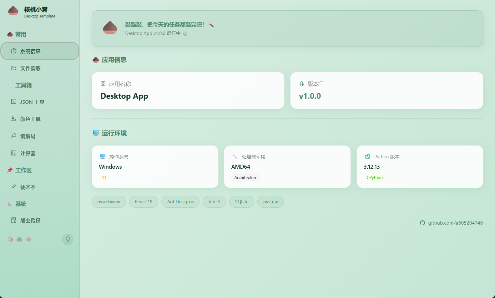

# pywebview Desktop Template

**English** | [中文](./README.md)

A PC desktop application template built with **pywebview + React + Vite**, ideal for quickly creating desktop tools with native windows, system tray, and local persistence.

The frontend can be entirely replaced with Vue, Svelte, or any other framework — the Python backend and bridge layer remain unchanged.

---

## Prerequisites

| Dependency | Min Version | Notes |
|------------|-------------|-------|
| Python | 3.11+ | Specified in `pyproject.toml` as `>=3.11` |
| Node.js | 18+ | Required by Vite 5 + React 18 |
| uv | Latest | Python package manager replacing pip+venv. [Install guide](https://docs.astral.sh/uv/getting-started/installation/) |
| npm | 9+ | Bundled with Node.js |

> **No uv?** Run `pip install uv` or check the [official docs](https://docs.astral.sh/uv/). uv automatically creates `.venv` and manages dependencies — much simpler than manual pip + venv.

---

## Quick Start

```bash
# 1. Clone the repo
git clone https://github.com/yourname/pywebview-desktop-template.git
cd pywebview-desktop-template

# 2. Install Python dependencies (uv auto-creates .venv)
uv sync

# 3. Install frontend dependencies
cd frontend && npm install && cd ..

# 4. Start dev mode
uv run python scripts/dev.py
```

After launching, a native desktop window appears with a navigation sidebar and feature pages. In dev mode, Vite provides hot module replacement — frontend changes are reflected instantly.

---

## Directory Structure

```
pywebview-desktop-template/
├── pyproject.toml            # Python project config & dependencies (uv)
├── uv.lock                   # uv lockfile (like package-lock.json)
├── .gitignore
├── .gitattributes
│
├── backend/                  # Python backend
│   ├── main.py               # ★ pywebview entry (create window, mount API, tray)
│   ├── config.py             # ★ Unified config center (reads config/app_config.py)
│   ├── logger.py             # Logging module (rotating file + console dual output)
│   ├── db.py                 # Local persistence (SQLite KV + settings.json)
│   ├── tray.py               # System tray (pystray + Pillow)
│   ├── api/                  # JS ↔ Python bridge API (Mixin pattern)
│   │   ├── __init__.py       # ★ Api class definition, composes all Mixins
│   │   ├── system.py         # System info / auto-start
│   │   ├── file.py           # File reading
│   │   ├── storage.py        # KV store read/write
│   │   ├── shell.py          # Shell / open directory
│   │   └── license.py        # License verification & demo record CRUD
│   ├── build.spec            # PyInstaller onedir spec
│   └── build_onefile.spec    # PyInstaller single-file spec
│
├── config/                   # Config & security modules
│   ├── app_config.py         # ★ App config (name, version, window size, port, etc.)
│   ├── assets/               # Icons and static resources
│   │   └── icon.png          # App icon (PNG / ICO supported)
│   └── secret/               # Encryption & licensing (encrypted by PyArmor at build)
│       ├── __init__.py        # Exports encrypt/decrypt/verify etc.
│       ├── cipher.py          # Fernet symmetric encryption (key derived from hardware fingerprint)
│       ├── kdf.py             # Key derivation function
│       ├── fingerprint.py     # Hardware fingerprint (MAC + CPU + disk serial)
│       └── license.py         # RSA-PSS license verification + NTP time check + offline tolerance
│
├── frontend/                 # React + Vite frontend (fully replaceable)
│   ├── src/
│   │   ├── main.tsx          # Entry (mounts Provider + Antd config)
│   │   ├── App.tsx           # Main layout (Sider + Content)
│   │   ├── bridge.ts         # ★ JS → Python universal bridge (framework-independent)
│   │   ├── theme.ts          # Theme color definitions
│   │   ├── components/       # Shared components (ErrorBoundary, Toast)
│   │   ├── contexts/         # React Context (ThemeContext, LicenseContext)
│   │   ├── hooks/            # Custom Hooks
│   │   ├── pages/            # Feature pages (SysInfo, Notes, JSON Tool, etc.)
│   │   └── styles/           # CSS
│   ├── scripts/dev.js        # Vite dev startup helper
│   ├── index.html
│   ├── package.json
│   ├── vite.config.ts         # ★ base: './' ensures file:// works after build
│   └── tsconfig.json
│
├── scripts/                  # Build & utility scripts
│   ├── dev.py                # ★ Dev startup (Vite dev server + pywebview)
│   ├── build.py              # ★ Build release (PyArmor → npm build → PyInstaller)
│   ├── obfuscate.py          # PyArmor obfuscation script
│   ├── build.spec            # onedir spec
│   ├── build_onefile.spec    # single-file spec
│   ├── gen_keypair.py        # RSA keypair generation
│   ├── gen_license.py        # License signing
│   └── hook_pythonnet.py     # PyInstaller hook
│
└── data/                     # Runtime data (gitignored)
    ├── app.db                # SQLite database
    ├── settings.json         # App settings
    └── logs/                 # Log files
```

---

## Core Architecture

### Python ↔ JS Bridge

This is the core design of the project. Understanding it lets you extend functionality freely.

**Backend (Python):**

The `Api` class in `backend/api/__init__.py` is mounted to `window.pywebview.api` by pywebview. Every **public method** (not starting with `_`) is automatically exposed to JS.

Api uses a **Mixin composition pattern** — each feature module is an independent Mixin class in a separate file under `backend/api/`:

```python
# backend/api/__init__.py
from .system import SystemMixin
from .file import FileMixin
from .storage import StorageMixin
from .shell import ShellMixin
from .license import LicenseMixin

class Api(SystemMixin, FileMixin, StorageMixin, ShellMixin, LicenseMixin):
    """pywebview js_api mount point"""
```

**Frontend (JS/TS):**

`frontend/src/bridge.ts` provides a unified `call()` function with built-in timeout protection and mock fallback:

```typescript
import { call } from './bridge'

// Call a Python method
const { success, data } = await call('get_app_info')
if (success) {
  console.log(data) // { name: "Desktop App", version: "1.0.0", ... }
}
```

**Adding a new feature takes only two steps:**

1. Create a new Mixin file under `backend/api/` with public methods
2. Call it from any frontend TS/JS file with `call('method_name', args)`

No registration, no config changes — just add the new Mixin to the base class list in `__init__.py`.

### Unified Return Format

All API methods return `{"success": bool, "data": any, "message": str}`:

```python
def my_method(self) -> dict:
    try:
        result = do_something()
        return {"success": True, "data": result}
    except Exception as e:
        return {"success": False, "message": str(e)}
```

The frontend can uniformly check the `success` field and use `message` for error prompts.

### Configuration System

Configuration is split into two layers:

| File | Purpose | Notes |
|------|---------|-------|
| `config/app_config.py` | Everyday config | App name, version, window size, port, log level, etc. |
| `backend/config.py` | Runtime config | Reads `app_config.py` and computes paths (auto-detects dev/packaged mode) |

To change window size, port, or app name, just edit `config/app_config.py` — no other files needed.

For paths, `config.py` switches based on `sys.frozen`:
- Dev mode: data dir = `<project_root>/data/`
- Packaged: data dir = `<exe_dir>/data/`

### Security Module (Licensing + Encryption)

The project includes a complete licensing and encryption system:

**License System:**

- RSA-2048 PSS asymmetric signature — cannot forge licenses without the private key
- License bound to hardware fingerprint (MAC + CPU + disk serial) — copying to another machine won't work
- NTP online time check prevents bypassing expiration by changing the system clock
- Offline tolerance: first activation requires internet, then up to 72 hours offline

**Symmetric Encryption:**

- Fernet (AES-128-CBC + HMAC-SHA256) encrypts sensitive fields
- Key derived from hardware fingerprint — ciphertext is bound to the current machine and unreadable elsewhere

**Utility Scripts:**

```bash
# Generate RSA keypair (private key saved to scripts/private.pem, NEVER commit to git)
uv run python scripts/gen_keypair.py

# Sign a license (requires private key + user's fingerprint code)
uv run python scripts/gen_license.py
```

After running `gen_keypair.py`, the public key PEM is printed to terminal — manually paste it into the `_PUBLIC_KEY_PEM` constant in `config/secret/license.py`.

---

## Common Commands

```bash
# ── Dependency Management ──
uv sync                        # Sync Python dependencies (must run after cloning)
uv add <package>               # Add a Python dependency
uv remove <package>            # Remove a Python dependency
cd frontend && npm install     # Install frontend dependencies

# ── Development ──
uv run python scripts/dev.py   # Start dev mode (Vite HMR + pywebview window)

# ── Build ──
uv run python scripts/build.py              # Build onedir version (recommended, fast startup)
uv run python scripts/build.py --onefile    # Build single-file exe (easy to distribute)

# ── License Tools ──
uv run python scripts/gen_keypair.py        # Generate RSA keypair
uv run python scripts/gen_license.py        # Sign a license
```

---

## Customize App Info

Edit `config/app_config.py`:

```python
NAME    = "My App"        # Window title & tray tooltip
VERSION = "1.0.0"
ICON    = "icon.png"      # Icon filename in config/assets/

WINDOW_WIDTH      = 1280  # Initial window width
WINDOW_HEIGHT     = 800   # Initial window height
WINDOW_MIN_WIDTH  = 800   # Minimum width
WINDOW_MIN_HEIGHT = 600   # Minimum height
WINDOW_RESIZABLE  = True  # Resizable window
CLOSE_TO_TRAY     = True  # Close button hides to tray (False = direct exit)

DEV_PORT  = 5174          # Vite dev server port
VITE_WAIT = 2.5           # Seconds to wait for Vite ready

LOG_LEVEL        = "INFO" # Log level
LOG_MAX_SIZE_MB  = 5      # Max MB per log file
LOG_BACKUP_COUNT = 3      # Number of historical log files
```

---

## Custom Icon

Place your icon file (PNG or ICO) in `config/assets/`, then set the `ICON` field in `config/app_config.py`.

The framework automatically applies the icon to the window title bar and system tray. It's also handled during the build process.

---

## Adding New Features

### Backend: New API Method

1. Create a new file under `backend/api/`, e.g. `backend/api/weather.py`:

```python
from __future__ import annotations

class WeatherMixin:
    def get_weather(self, city: str) -> dict:
        """Get weather info"""
        try:
            # your business logic
            return {"success": True, "data": {"city": city, "temp": 25}}
        except Exception as e:
            return {"success": False, "message": str(e)}
```

2. Add the new Mixin to `backend/api/__init__.py`:

```python
from .weather import WeatherMixin

class Api(WeatherMixin, SystemMixin, FileMixin, StorageMixin, ShellMixin, LicenseMixin):
    pass
```

3. Call from frontend:

```typescript
import { call } from './bridge'
const { success, data } = await call('get_weather', 'Beijing')
```

### Frontend: New Page

1. Create a new page component under `frontend/src/pages/`, e.g. `Weather.tsx`
2. Add a menu item and page mapping in `frontend/src/App.tsx`

---

## Switching Frontend Framework

The backend stays completely unchanged — just replace the frontend:

1. Delete the `frontend/` directory
2. Initialize with a new framework: e.g. `npm create vue@latest frontend` or `npm create svelte@latest frontend`
3. Copy `bridge.ts` (from the original frontend) into the new project's `src/` directory. If the new framework uses JS, rename `.ts` to `.js` and remove the type declarations.
4. In the new framework's Vite config, set `base: './'` (critical! After build, pywebview loads via `file://`, and relative paths are needed for assets)
5. Run `uv run python scripts/dev.py` to verify

---

## Local Persistence

Two persistence methods are provided:

| Method | File | Use Case | Usage |
|--------|------|----------|-------|
| SQLite KV | `data/app.db` | Cache, state, temp data | `from db import kv_get, kv_set, kv_delete` |
| JSON Settings | `data/settings.json` | User config | `from db import load_settings, save_settings` |

Frontend can also operate via API:

```typescript
await call('set_setting', 'theme', 'dark')
const { data } = await call('get_setting', 'theme', 'light')
```

---

## System Tray

The app supports a system tray icon, configured in `config/app_config.py`:

- `CLOSE_TO_TRAY = True`: Closing the window hides it to tray; double-click tray icon to restore
- `CLOSE_TO_TRAY = False`: Closing the window exits the process

The tray menu includes "Show Window" and "Exit" options.

---

## Build & Package

The build process has three steps: PyArmor obfuscation → Vite build → PyInstaller packaging.

```bash
# onedir mode (recommended, fast startup, output: output/dist/desktop-app/)
uv run python scripts/build.py

# single-file mode (easy to distribute, output: output/dist/desktop-app.exe)
uv run python scripts/build.py --onefile
```

**Note:** PyArmor 8 free edition limits each project to 10 scripts. For more, a commercial license is needed. If you don't need obfuscation protection, comment out the `obfuscate_backend()` step in `scripts/build.py`.

---

## Dev Tips

- **Frontend standalone debugging**: `bridge.ts` has built-in mock fallback — when opening the frontend in a plain browser, all `call()` returns `{success: false, message: 'pywebview not ready'}`, won't block UI development
- **Hot reload**: Dev mode uses Vite HMR for frontend; Python changes need a restart (Ctrl+C then re-run `dev.py`)
- **Logging**: In dev, logs output to both console and `data/logs/app.log`; after packaging, only file logging
- **Single instance**: On startup, the app checks for an existing instance (Windows named mutex) — duplicate launches show a warning and exit

---

## Tech Stack

| Layer | Technology |
|-------|-----------|
| Desktop framework | pywebview 4.4+ |
| Frontend framework | React 18 + Vite 5 |
| UI library | Ant Design 6 |
| Language | TypeScript + Python 3.11+ |
| Package manager | uv (Python) + npm (Node) |
| Local storage | SQLite + JSON |
| Encryption | cryptography (Fernet + RSA) |
| Tray | pystray + Pillow |
| Obfuscation | PyArmor 8 |
| Packaging | PyInstaller 6 |

---

## License

MIT